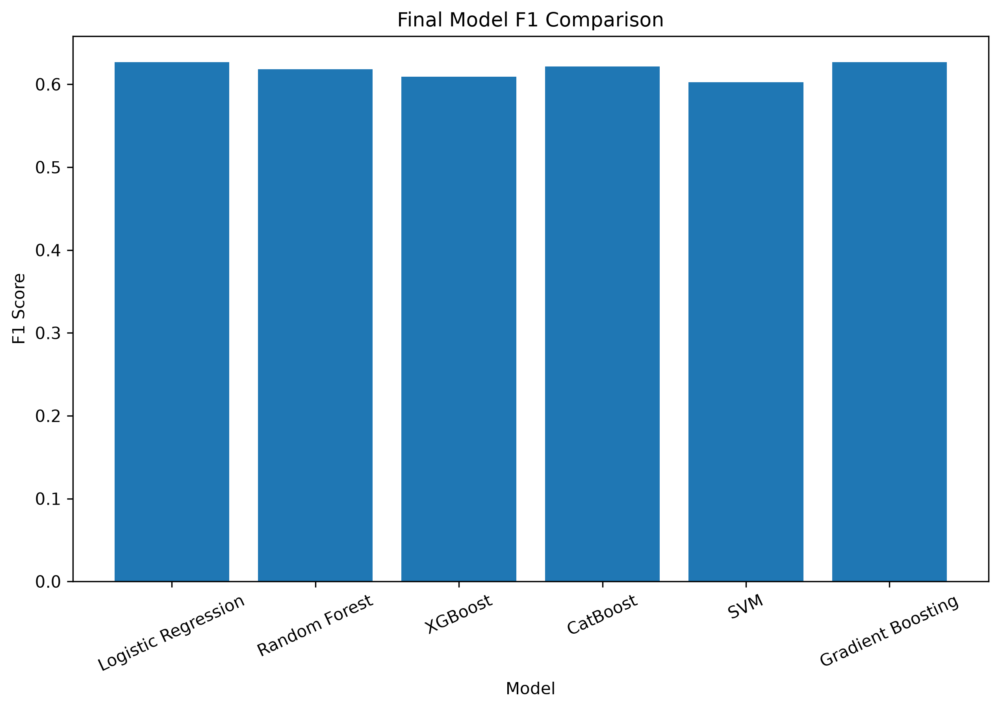
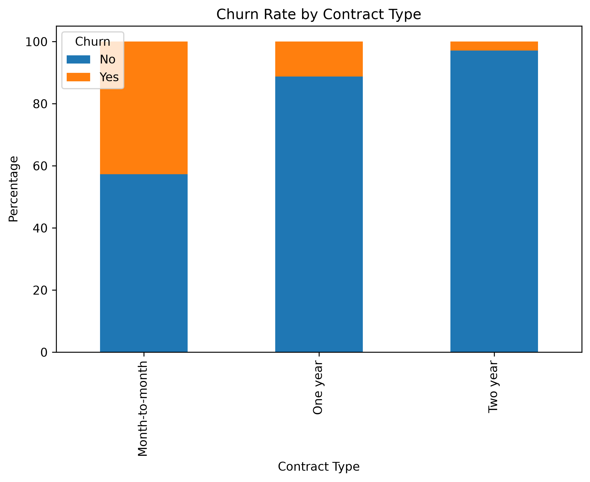
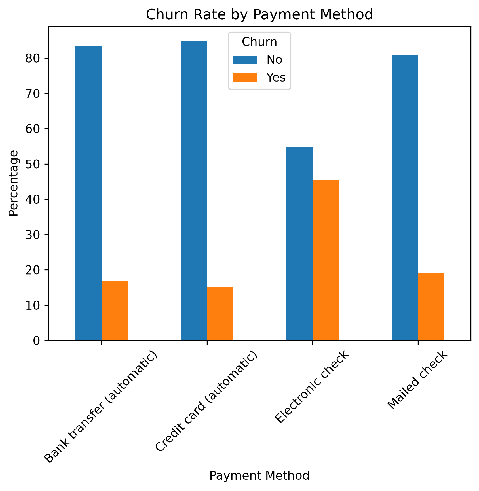

# Customer Churn Prediction

A machine learning classification project that predicts whether a telecommunications customer is likely to churn.

The project focuses on building a complete machine learning workflow, including data exploration, preprocessing, feature engineering, baseline modeling, hyperparameter tuning, probability threshold optimization, and final model comparison.

## Project Overview

Customer churn prediction is a common business problem where the goal is to identify customers who are likely to leave a service.

In this project, several classification algorithms were trained and compared using the Telco Customer Churn dataset. Because churn is an imbalanced classification problem, the models were evaluated primarily using **F1 score**, while also considering precision and recall.

The project also explores whether changing the default classification threshold from `0.5` can improve churn detection.

## Dataset

The dataset contains **7,043 customers** and includes demographic information, account information, subscribed services, contract details, payment methods, and churn status.

### Target Variable

* `Churn`

  * `Yes` — customer churned
  * `No` — customer did not churn

### Main Features

Examples of features used include:

* `tenure`
* `MonthlyCharges`
* `TotalCharges`
* `Contract`
* `PaymentMethod`
* `InternetService`
* `TechSupport`
* `OnlineSecurity`
* `OnlineBackup`
* `DeviceProtection`
* `StreamingTV`
* `StreamingMovies`
* `SeniorCitizen`
* `Partner`
* `Dependents`

The `customerID` column was removed because it is an identifier and does not provide useful predictive information.


## Machine Learning Pipeline

The project follows the following workflow:

```text
Raw Dataset
     ↓
Data Exploration
     ↓
Data Cleaning
     ↓
Feature Engineering
     ↓
Train / Validation / Test Split
     ↓
Preprocessing
     ↓
Baseline Models
     ↓
Hyperparameter Tuning
     ↓
Threshold Optimization
     ↓
Final Evaluation
     ↓
Model Comparison
```

## Data Cleaning

The following preprocessing steps were performed:

* Removed `customerID`
* Converted `TotalCharges` from string to numeric
* Invalid numeric values were converted to missing values
* Missing numerical values are handled using median imputation inside the preprocessing pipeline
* Checked for duplicated rows
* Examined numerical features for potential outliers

No rows were removed solely because of the observed tenure distribution.

## Feature Engineering

Several additional features were created to capture potentially useful relationships in the data.

### TotalServices

Counts the number of additional services subscribed to by a customer:

* Online Security
* Online Backup
* Device Protection
* Tech Support
* Streaming TV
* Streaming Movies

### Internet_TechSupport

Combines internet service type and technical support status to capture their interaction.

### New_MonthtoMonth

Identifies customers with:

* Tenure ≤ 12 months
* Month-to-month contracts

### Senior_TotalServices

Represents the interaction between senior citizen status and the number of additional services.

### CustomerTenureGroup

Customers were divided into:

* `New` — tenure ≤ 12 months
* `Established` — tenure > 12 months

These engineered features were used during model tuning.

## Preprocessing

For models requiring numerical preprocessing:

* Categorical variables were encoded using `OneHotEncoder`
* Unknown categories are ignored during transformation
* Numerical missing values are handled using `SimpleImputer(strategy="median")`
* Numerical features are standardized using `StandardScaler`

Preprocessing is implemented using scikit-learn `Pipeline` and `ColumnTransformer` to ensure that transformations are applied consistently.

## Models

The following classification algorithms were evaluated:

1. Logistic Regression
2. Random Forest
3. XGBoost
4. CatBoost
5. Support Vector Machine (SVM)
6. Gradient Boosting

Both baseline and tuned versions were evaluated where applicable.

### CatBoost

CatBoost was handled separately because it can work directly with categorical features rather than requiring one-hot encoding.

## Hyperparameter Tuning

Hyperparameter tuning was performed using `GridSearchCV` with cross-validation.

The primary optimization metric was:

**F1 Score**

This was chosen because the dataset contains fewer churned customers than non-churned customers, making accuracy alone less informative.

### Example tuned parameters

#### Logistic Regression

* `C`
* `l1_ratio`
* `class_weight`
* `solver`

#### Random Forest

* `n_estimators`
* `max_depth`
* `min_samples_split`
* `min_samples_leaf`

#### XGBoost

* `n_estimators`
* `max_depth`
* `learning_rate`

#### CatBoost

* `iterations`
* `depth`
* `learning_rate`
* `l2_leaf_reg`

#### SVM

* `C`
* `gamma`
* `kernel`
* `class_weight`

#### Gradient Boosting

* `n_estimators`
* `learning_rate`
* `max_depth`
* `min_samples_leaf`

## Threshold Optimization

Instead of automatically using the default classification threshold of `0.5`, the project searches for a threshold that maximizes F1 score on the **validation set**.

The test set is then evaluated using the selected threshold.

This approach separates threshold selection from final model evaluation and helps avoid tuning the threshold directly on the test data.

For SVM, decision scores were used instead of probabilities because the model was trained without probability estimation.

## Results

### Baseline Models

| Model               | Precision | Recall |    F1 |
| ------------------- | --------: | -----: | ----: |
| Logistic Regression |     0.690 |  0.530 | 0.600 |
| Random Forest       |     0.635 |  0.452 | 0.528 |
| XGBoost             |     0.600 |  0.459 | 0.520 |
| CatBoost            |     0.655 |  0.466 | 0.545 |

### Tuned Models

| Model               | CV F1 | Test F1 |
| ------------------- | ----: | ------: |
| Logistic Regression | 0.631 |   0.622 |
| Random Forest       | 0.584 |   0.548 |
| XGBoost             | 0.591 |   0.537 |
| CatBoost            | 0.594 |   0.552 |
| SVM                 | 0.631 |   0.603 |
| Gradient Boosting   | 0.587 |   0.549 |

### Final Results After Threshold Optimization

| Model               | Precision | Recall |    F1 | Threshold |
| ------------------- | --------: | -----: | ----: | --------: |
| Logistic Regression |     0.543 |  0.740 | 0.627 |      0.52 |
| Random Forest       |     0.540 |  0.722 | 0.618 |      0.31 |
| XGBoost             |     0.530 |  0.715 | 0.609 |      0.29 |
| CatBoost            |     0.549 |  0.715 | 0.621 |      0.31 |
| SVM                 |     0.581 |  0.626 | 0.603 |      0.57 |
| Gradient Boosting   |     0.532 |  0.762 | 0.627 |      0.28 |

### Best Final Models

Based on test-set F1 score:

* **Gradient Boosting:** 0.627
* **Logistic Regression:** 0.627
* **CatBoost:** 0.621
* **Random Forest:** 0.618
* **XGBoost:** 0.609
* **SVM:** 0.603

Threshold optimization substantially increased recall for several models.

For example, Logistic Regression increased recall from approximately **0.53 to 0.74**, while maintaining an F1 score of approximately **0.63**.

## Visualizations

The project generates visualizations for:

* Churn class distribution
* Tenure outlier analysis
* Churn rate by contract type
* Churn rate by payment method
* Confusion matrices
* Final model F1 comparison

### Final Model Comparison



### Churn Rate by Contract



### Churn Rate by Payment Method



## Technologies Used

* Python
* pandas
* NumPy
* scikit-learn
* XGBoost
* CatBoost
* matplotlib
* joblib

## Installation

Clone the repository and install the required dependencies:

```bash
git clone <your-repository-url>
cd customer-churn
pip install -r requirements.txt
```

## Running the Project

Run:

```bash
python src/main.py
```

The script will:

1. Load the dataset
2. Perform data exploration
3. Clean and transform the data
4. Create engineered features
5. Train baseline models
6. Perform hyperparameter tuning
7. Optimize classification thresholds
8. Evaluate the models
9. Save trained models
10. Save plots and results

Generated models are stored in:

```text
models/
```

Generated visualizations are stored in:

```text
plots/
```

Final model results are stored in:

```text
results/results.csv
```

## Key Takeaways


The main findings were:

* Logistic Regression provided the strongest baseline F1 score.
* Hyperparameter tuning improved some models but did not guarantee better test performance.
* Threshold optimization significantly improved recall for churn detection.
* Gradient Boosting and Logistic Regression achieved the highest final test F1 score at approximately **0.627**.
* Precision-recall trade-offs are important in churn prediction because identifying potential churners may be more valuable than maximizing overall accuracy.

## Future Improvements

Potential improvements include:

* More extensive hyperparameter optimization
* Cross-validation with additional evaluation metrics
* ROC-AUC and PR-AUC analysis
* Calibration of predicted probabilities
* SHAP-based model explainability
* Feature importance analysis
* Experiment tracking
* Building a prediction API
* Deploying the best model as a small web application

